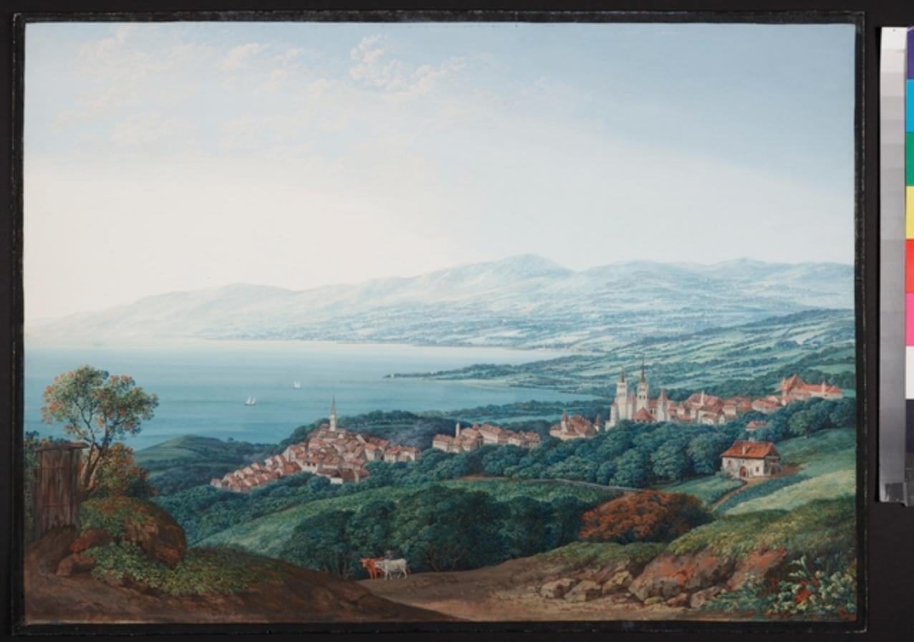

  

    <h1 style="color: #000;">Évolution des Espaces Végétaux Lausannois</h1>
    <h2>Analyse historique et spatiale de 1721 à 2024</h2>
    

      
      
HUM-454 – Mathieu Verest, Romain Frossard, Maxime Risse, Jean Ciardo.

    

  

  
  
Source : <a href="https://www.mcba.ch/collection/lausanne-et-le-lac-leman-1842/" target="_blank" rel="noopener">MCBA – Lausanne et le lac Léman, 1842</a>

---
## Introduction

Depuis les années 1700, la ville de Lausanne a connu une transformation urbaine profonde, marquée par une expansion rapide et une densification progressive de son territoire. Ce fort développement, accompagné d’une urbanisation intense, a profondément modifié le paysage naturel de la région. Les milieux naturels tels que les forêts, champs, ou encore le marais ont dû parfois céder la place à une ville en pleine expansion. Plus récemment, la tendance est à l’émergence de nouveaux types d’espaces face aux enjeux croissants de qualité de vie et de durabilité dans un tissu urbain dense. Ainsi, ce projet vise à analyser comment les espaces végétaux de Lausanne ont évolué du XVIIIᵉ siècle à aujourd’hui, entre destruction et reconfiguration.

## Processus

Afin d’analyser l’évolution des espaces verts à Lausanne entre 1721 et aujourd’hui, nous avons adopté une approche fondée sur l’exploitation de sources cartographiques historiques et contemporaines. Notre étude repose sur quatre référentiels principaux : le cadastre Melotte (1721), le cadastre Berney (1831), le cadastre rénové (1888) et le cadastre de 2024. En raison des limites de certains cadastres, nous considérons dans notre analyse une zone restreinte au centre de Lausanne et ses alentours, commune à toutes les sources considérées.

Pour chaque époque, nous avons extrait et vectorisé les surfaces végétalisées présentes sur les documents cadastraux, en nous appuyant sur les éléments lisibles et interprétables de chaque carte. Ces espaces ont ensuite été regroupés en macro-classes (forêts, prés, champs, vignes, bosquets, jardins) permettant une comparaison cohérente malgré les différences de précision, de style et d’échelle entre les cadastres.

Cette classification permet d’identifier les grandes tendances dans la transformation du paysage végétal lausannois au fil du temps, comme la disparition ou la réduction de certains types de milieux naturels. Cette démarche offre un cadre pour évaluer l’impact de l’urbanisation sur la trame verte de la ville et pour comprendre les dynamiques écologiques sous-jacentes.

---

<article>
  <h2>Limites de l’approche par Macro-classes&nbsp;: le cas de Melotte</h2>

  

    Le cadastre Melotte&nbsp;(1721) est intéressant car le plus distant du temps
    présent. Cette distance se traduit de plusieurs manières. Premièrement, le
    format du cadastre : il se présente en plusieurs planches dans un format
    qui n’est pas conçu pour être manipulé aplati. Cela génère des
    discontinuités lorsque les différentes planches sont mises bout à bout, ce
    qui rend difficile le géoréférencement précis (et a par exemple généré
    beaucoup de géométries invalides dans les SIG utilisés).
  

  

    Ensuite, avec la distance temporelle vient souvent une forme de distance
    linguistique. La gestion de la concordance des termes et des usages est
    primordiale pour toute tentative d’analyse quantitative et, dans notre cas,
    constitue l’une des principales sources d’incertitudes. Pour illustrer
    cela, nous avons constitué un petit lexique basé sur le livre
    <em>Nos&nbsp;Lieux-dits, Toponymie Romande</em> de Maurice&nbsp;Bossard et
    Jean-Pierre&nbsp;Chavan&nbsp;:
  

<dl class="glossary">
  <dt>Chenevrier</dt>
  <dd>Parcelle réservée à la culture du chanvre, l’une des principales cultures de l’époque</dd>

  <dt>Commun</dt>
  <dd>Un terrain appartenant à la communauté, généralement un pré ou un bois</dd>

  <dt>Clos</dt>
  <dd>Petit pré mis à clos, le plus souvent près du village</dd>

  <dt>Mas</dt>
  <dd>Une ferme et son domaine</dd>

  <dt>Chentre</dt>
  <dd>Bord, limite d’un champ ; espace pour faire tourner l’attelage</dd>

  <dt>Record</dt>
  <dd>Pré clôturé après les foins pour permettre une deuxième récolte de fourrage</dd>

  <dt>Planche</dt>
  <dd>Terrain plat, généralement proche d’une maison, pré gras</dd>

  <dt>Pasquier</dt>
  <dd>Pâturage</dd>
</dl>

  

    Des choix ont dû être faits pour faire correspondre ces catégories à celles
    que nous avons déterminées pertinentes pour analyser l’ensemble des
    cadastres. Par exemple, nous avons décidé de catégoriser les parcelles
    marquées comme étant des « Terres » en terrains agricoles par analogie avec
    le cadastre Berney&nbsp;(1888) – décision étayée par des représentations
    picturales montrant, en plus des vignes, des terres cultivées qui seraient
    autrement absentes de notre représentation.
  

   

  

    L’impact de ces décisions sur les analyses quantitatives – mis en
    perspective avec nos connaissances limitées sur le sujet – renforce le fait
    qu’une étude approfondie de telles questions nécessite des expertises
    pluridisciplinaires.
  

</article>

